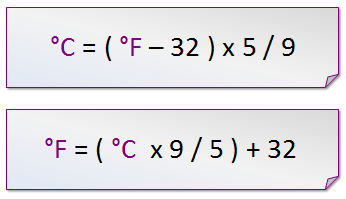
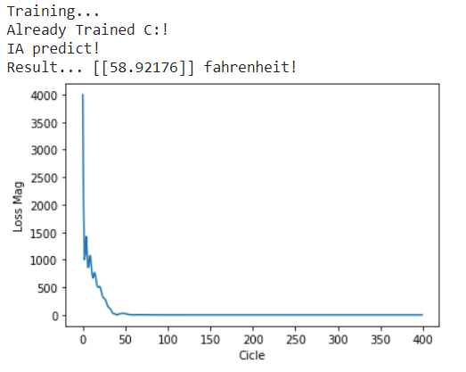

# CelciusAndFahrenheit_AI
This is my first time using and understanding AI using Python
It is no necesary to use for solve this problem using just classic programming this would be solved but thats why i chose this problem. SIMPLICITY

## 1-1 Neurons
This problem is very simple so we dont need hidden layers but... i will experiment a little bit with this.

## Traditional Programming

This is a extremely easy formula to code that is why i chose it to start with IA

## Sample Image

A ss of the hidden layers IA 
